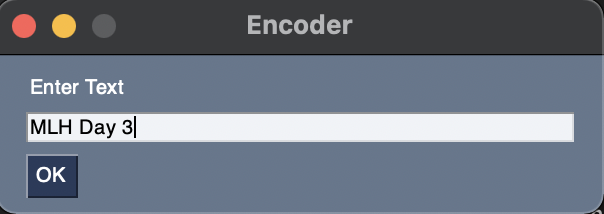
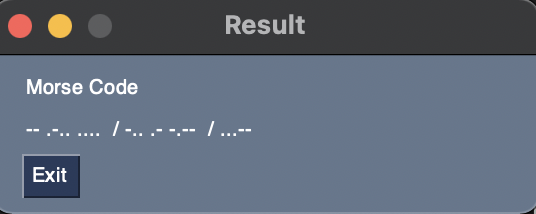
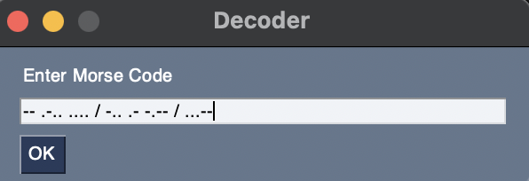

# morse-translator
A simple GUI to encode and decode morse code in Python

## How to run

For installation of required packages, run:

```sh
pip install -r requirements.txt
```

Run main.py in your terminal:

```sh
python morse_translator.py
```

## Screenshots

### Choice Window


### Encoding




###Decoding

